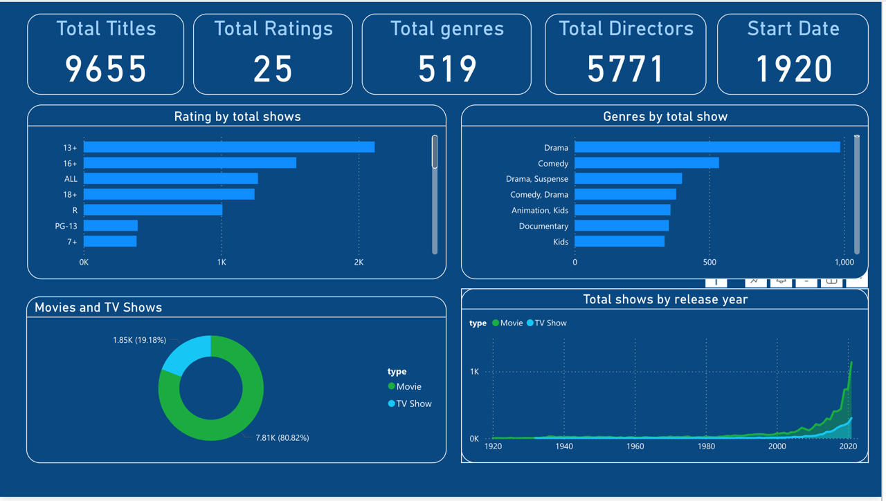

# Amazon Prime Power BI Dashboard 

## Overview
This Power BI dashboard was created to visualize and analyze a dataset of movies and TV shows. The dashboard incorporates various charts and visualizations to provide insights into the distribution, trends, and key metrics related to the dataset.

## Steps to Create the Dashboard

### 1. **Explore the Dataset**
   - Before creating any visualizations, it’s essential to explore the dataset. Familiarize yourself with the data columns, contents, and any potential relationships between them.

### 2. **Set Background Color**
   - Customize the appearance of the Power BI report canvas by setting the background color under the "Format" options. This helps to visually organize and highlight different sections of the dashboard.

### 3. **Field Map Visualization**
   - Use field map visualizations to represent data distribution across different countries. This visual helps in understanding the geographic spread of movies and TV shows in the dataset.

### 4. **Donut Charts for Proportions**
   - Create donut charts to illustrate the proportion of movies and TV shows. This visual allows for an easy comparison between these two categories in the dataset.

### 5. **Area Charts for Trend Analysis**
   - Use area charts to display trends over time, specifically for the release year of movies and TV shows. This visual highlights how the production of content has changed across different years.

### 6. **Horizontal Bar Charts for Comparison**
   - Develop horizontal bar charts to compare ratings and genres based on the total number of shows. This visualization provides a clear comparison of how different genres and ratings are represented in the dataset.

### 7. **Cards for Summarized Information**
   - Utilize card visualizations to display key summarized information such as:
     - Total number of titles
     - Ratings
     - Genres
     - Directors
     - Release years
   - Cards offer a quick snapshot of important metrics from the dataset.

### 8. **Calculate and Display Additional Metrics**
   - Calculate additional metrics like the start date (minimum release year) and end date (maximum release year) to give a comprehensive view of the timeline of content in the dataset. These metrics can be displayed alongside other key information to enrich the dashboard.

## Conclusion
This Power BI dashboard provides a detailed and visually appealing analysis of a movie and TV show dataset. By exploring various visualizations like maps, charts, and cards, it offers users a comprehensive overview of the data's key trends and metrics.

